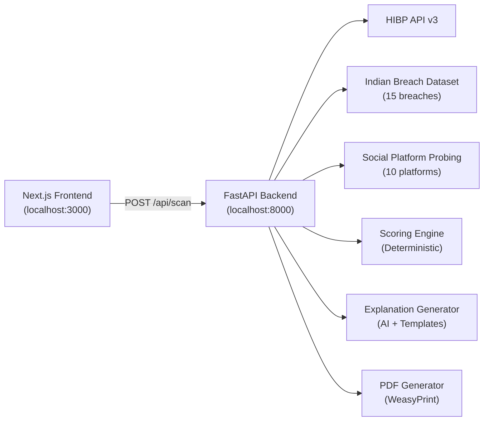

# Digital Footprint Checker — Walkthrough

## What Was Built

A full-stack **digital exposure scanner** that checks email addresses against breach databases and social platforms, then generates a visual report with actionable remediation steps.

---

## Architecture

---

## Components Built

### Backend (FastAPI)

| File | Purpose |
|------|---------|
| [main.py](file:///c:/Users/Rajat/Downloads/Digital%20Footprint%20Checker/backend/main.py) | App entry with CORS, CSP headers, rate limiting |
| [routers/scan.py](file:///c:/Users/Rajat/Downloads/Digital%20Footprint%20Checker/backend/routers/scan.py) | Main scan endpoint orchestrating all checks |
| [routers/report.py](file:///c:/Users/Rajat/Downloads/Digital%20Footprint%20Checker/backend/routers/report.py) | PDF report generation endpoint |
| [services/hibp.py](file:///c:/Users/Rajat/Downloads/Digital%20Footprint%20Checker/backend/services/hibp.py) | HIBP API v3 client with demo fallback |
| [services/indian_breaches.py](file:///c:/Users/Rajat/Downloads/Digital%20Footprint%20Checker/backend/services/indian_breaches.py) | 15 curated Indian breach entries |
| [services/social_scan.py](file:///c:/Users/Rajat/Downloads/Digital%20Footprint%20Checker/backend/services/social_scan.py) | Async username probing across 10 platforms |
| [services/scoring.py](file:///c:/Users/Rajat/Downloads/Digital%20Footprint%20Checker/backend/services/scoring.py) | Deterministic 0-100 exposure score |
| [services/explanations.py](file:///c:/Users/Rajat/Downloads/Digital%20Footprint%20Checker/backend/services/explanations.py) | AI + template explanation generator |
| [services/pdf_generator.py](file:///c:/Users/Rajat/Downloads/Digital%20Footprint%20Checker/backend/services/pdf_generator.py) | WeasyPrint PDF export |
| [security/validators.py](file:///c:/Users/Rajat/Downloads/Digital%20Footprint%20Checker/backend/security/validators.py) | RFC 5322 email, XSS sanitization |
| [security/rate_limiter.py](file:///c:/Users/Rajat/Downloads/Digital%20Footprint%20Checker/backend/security/rate_limiter.py) | SlowAPI + bulk enumeration detection |
| [security/honeypot.py](file:///c:/Users/Rajat/Downloads/Digital%20Footprint%20Checker/backend/security/honeypot.py) | Bot detection via hidden form field |
| [cache/memory_cache.py](file:///c:/Users/Rajat/Downloads/Digital%20Footprint%20Checker/backend/cache/memory_cache.py) | SHA-256 keyed in-memory cache with TTL |

### Frontend (Next.js 14)

| File | Purpose |
|------|---------|
| [page.tsx](file:///c:/Users/Rajat/Downloads/Digital%20Footprint%20Checker/frontend/src/app/page.tsx) | Landing page with hero, scan form, features |
| [report/page.tsx](file:///c:/Users/Rajat/Downloads/Digital%20Footprint%20Checker/frontend/src/app/report/page.tsx) | Full report display page |
| [ScanForm.tsx](file:///c:/Users/Rajat/Downloads/Digital%20Footprint%20Checker/frontend/src/components/ScanForm.tsx) | Email/username input with honeypot |
| [ExposureGauge.tsx](file:///c:/Users/Rajat/Downloads/Digital%20Footprint%20Checker/frontend/src/components/ExposureGauge.tsx) | Animated SVG circular gauge |
| [BreachCard.tsx](file:///c:/Users/Rajat/Downloads/Digital%20Footprint%20Checker/frontend/src/components/BreachCard.tsx) | Collapsible breach detail cards |
| [SocialGrid.tsx](file:///c:/Users/Rajat/Downloads/Digital%20Footprint%20Checker/frontend/src/components/SocialGrid.tsx) | Platform presence grid with SVG icons |
| [ActionPlan.tsx](file:///c:/Users/Rajat/Downloads/Digital%20Footprint%20Checker/frontend/src/components/ActionPlan.tsx) | Priority-ordered remediation checklist |
| [Footer.tsx](file:///c:/Users/Rajat/Downloads/Digital%20Footprint%20Checker/frontend/src/components/Footer.tsx) | Legal disclaimers and attribution |
| [globals.css](file:///c:/Users/Rajat/Downloads/Digital%20Footprint%20Checker/frontend/src/app/globals.css) | Complete design system |
| [api.ts](file:///c:/Users/Rajat/Downloads/Digital%20Footprint%20Checker/frontend/src/lib/api.ts) | Type-safe backend API client |

---

## Screenshots

### Landing Page

### Report — Exposure Score

### Report — Breach Cards

### Report — Social Grid & Action Plan

### Report — Full Action Plan

### Complete Scan Flow Recording

---

## Verification Results

### Backend
- ✅ Health endpoint: `GET /api/health` → `{"status": "healthy", "demo_mode": true}`
- ✅ Scan endpoint: `POST /api/scan` → 200 with 5 HIBP breaches, 15 Indian breaches, 5 platforms, score 100/100
- ✅ Template-based explanations generated for all breaches
- ✅ 6 action items generated with correct priorities
- ✅ Rate limiting active (SlowAPI)
- ✅ CSP headers present on all responses

### Frontend
- ✅ `npm run build` — compiled with zero errors
- ✅ Landing page renders with hero, form, features
- ✅ Scan form → submits → navigates to /report
- ✅ Report page displays all sections correctly
- ✅ Animated exposure gauge works
- ✅ Breach cards with severity badges and data type chips
- ✅ Social grid with platform icons and status indicators
- ✅ Action plan with color-coded priority cards

### Security
- ✅ HIBP API key never exposed in frontend
- ✅ Email not in URL or response payload
- ✅ Honeypot field present and functional
- ✅ Demo mode clearly labeled with warning banner
